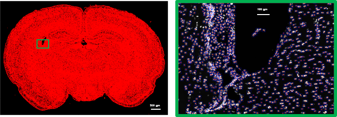
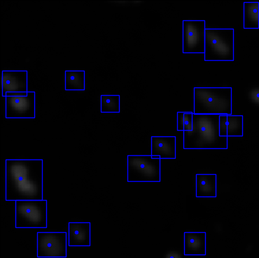
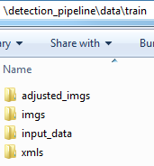

# detection_pipeline:

detection_pipeline is a tool for cell detection in large biomedical images with nuclei stained biomarker.


Our goal is to perform large scale cell detection in an accurate and rubost manner.



# Requirements:

* Tensorflow >= 1.4
* [Protobuf](https://github.com/google/protobuf/releases)
* [pycocotools](https://github.com/waleedka/coco)


# Installation:
#### 1. Protobuf:
Download executable from [here](https://github.com/google/protobuf/releases) and run the following command from ```lib``` directory:
``` bash
protoc object_detection/protos/*.proto --python_out=.
```
(__for Windows__):
```
# From Protoc*/bin
SET PATH=%PATH%;%cd%
```

(__for Linux and Mac__):
```bash
# From Protoc*/bin
export PATH=$PATH:`pwd`
```

#### 2. TensorFlow:
Follow the instructions from [here](https://www.tensorflow.org/install/). 
#### 3. Pycocotools
(__for Linux and Mac__):
1. Make sure you have `gcc > 6.x`.
2. `git clone https://github.com/waleedka/coco.git`
3. `cd coco/PythonAPI`
4. `make`
5. find your `site-packages` folder for your python and copy `pycocotools` folder there:
    *  which python: `~/.conda/envs/tf/bin/python`
    * `cp -r pycocotools ~/.conda/envs/tf/lib/python3.6/site-packages`
    
(__for Windows__):
``` bash
pip install "git+https://github.com/philferriere/cocoapi.git#egg=pycocotools&subdirectory=PythonAPI"
```
#### 3. Install required libraries:
  ``` bash
  pip install -r requirments.txt
  ```

# Pipeline:

### 1. Crop large images:
Deep learning needs lots of samples (images in our case) to learn the  assigned task.
Moreover, fitting large images in the GPU memory is a challenging task.
To overcome these issues, we have to create small crops from the large image.

In `config.py`, change to `write_crops` mode. and specify the necessary parameters in `# write_crops` section.

This mode reads your large image in `input_dir` directory and creates small crops 
with size `crop_width` and `crop_height` and saves crops and xml files in `imgs` and `xmls` folders
 in `save_dir` folder.


 - You can use visualize if you want to see the first "n" crops to make sure everything is right.

   


 - You can adjust the intensity of the image __for visualization__ using `adjust_image`.
    
    

 
   - It will also create a new folder with intensity adjusted crops as `adjusted_hist`.
 
      
 


### 2. (optional) Fix bounding boxes using [LabelImg](https://github.com/tzutalin/labelImg)
If you generated the bounding boxes using automatic segmentation, it is suggested to use [LabelImg](https://github.com/tzutalin/labelImg) software to correct the bounding boxes.


After you updated the bounding boxes, you can update the existing `bbxs.txt` with the new bounding boxes.

In `config.py`, change to `update_xmls` mode. and specify the necessary parameters in `# update_xml` section.

This will update your `bbxs_file` specified in `config.py`. You can use this file to generate the `tfrecord` file.

### 3. Generate tfrecord file from xmls and imgs
After you created the crop images and corresponding xml files, you can generated the ```tfrecord``` file.
```tfrecord``` file is the input to your network.
```bash
python generate_tfrecord.py --input_dir=data/train --output_path=data/train/train.record
```
Create a label map for mapping classes to unique IDs. Create a ```nucleus_map.pbtxt``` file inside ```data``` folder and add following lines:
```vim
item {
name: "Nucleus"
id: 1
display_name: "Nucleus"
}
```

### 4. Train:
1. Download your pretrained model from [here](https://drive.google.com/open?id=1xvkkOij38YCO2_tVm5qAs4Xup1zoWrwC) and save it in folder ```models ```.

2. Inside the ```models``` folder copy the .config file from ```lib/object_detection/samples/configs/```.
For example ```faster_rcnn_inception_resnet_v2_atrous_coco.config``` file.

edit the following lines:

```vim
num_classes: 1

image_resizer {
   fixed_shape_resizer {
     width: 300
     height: 300
   }
}

second_stage_post_processing {
  batch_non_max_suppression {
    score_threshold: 0.0
    iou_threshold: 0.6
    max_detections_per_class: 300
    max_total_detections: 300
  }

fine_tune_checkpoint: pretrained_models/faster_rcnn_inception_resnet_v2_atrous_coco_2018_01_28

input_path: "data/train.record"
label_map_path: "data/nucleus_map.pbtxt"

eval_config: {
  num_examples: 8000
  # Note: The below line limits the evaluation process to 10 evaluations.
  # Remove the below line to evaluate indefinitely.
  max_evals: 10
}
eval_input_reader: {
  tf_record_input_reader {
  input_path: "data/train.record"
}
label_map_path: "data/nucleus_map.pbtxt"
shuffle: false
num_readers: 1
}
```

Now you can train your model by switching to `train` mode in `config.py`. Don't forget to specify the correct path to
the directory you want to save your model in `model_dir` and the path of your `pipeline_config_file` 
in `pipeline_config_path`.
  
### 5. Export Inference Graph:
After the training is done, you have to validate and test your network.```export_inference_graph``` freezes your model for testing.
Since we are using convolutional neural network, we can test larger images. So, we can create a new config file and change the size of the input image:
```vim
image_resizer {
   fixed_shape_resizer {
     width: 500
     height: 500
   }
}
```
__NOTE__: Remember to make sure the `max_proposals` fits to your image size
```bash
first_stage_max_proposals: 
max_detections_per_class: 
max_total_detections: 
```

Now we can freeze the model with new configuration.
```bash
python export_inference_graph.py --ipnut_type=image_tensor --pipeline_config_path=training/test.config --trained_checkpoint_prefix=training/model.ckpt-20000 --output_directory=freezed_model
```
__NOTE__: Make sure you have all 3 ```.index```,```.meta``` and ```.data``` files for that checkpoint.

### 6. Visualization Test:
1. Create ```test_image``` folder and put some sample images.
2. run ```test.ipynb``` in jupyter notebook.

### 7. Detect cells in large images:
After you are done with training and you checked your network works well, you can run the network on large images.
Switch to `test` mode in `config.py` and specify desired parameters.

If you do not have the trained models, download them from [here](https://drive.google.com/open?id=1xvkkOij38YCO2_tVm5qAs4Xup1zoWrwC).
```bash
python main.py \
--mode=test \
--pipeline_config_path=models/dapi/pipeline_config.config \
--trained_checkpoint=models/dapi/model.ckpt \
--input_dir=/path/to/folder/containing/images \
--output_dir=/path/to/folder/saving/detection_Results \
--channel=1 \
--c1=R2C1.tif
```
# Probable Errors:

1. If you faced this error:  
  ```bash
  ImportError: No module named 'object_detection'
  ```

  Add object_detection and slim folders to PYTHONPATH.  
  
  - (__for Windows__):
    ```bash
    # From tensorflow/models/research/
    SET PYTHONPATH=%cd%;%cd%\slim
    ```

  - (__for Linux and Mac__):
    ```bash
    # From tensorflow/models/research/
    export PYTHONPATH=$PYTHONPATH:`pwd`:`pwd`/slim
    ```

2. If your TensorFlow version is  < 1.5 you might have issues with object detection module. Go to commit 196d173 which is compatible with tf 1.4.1:

  ```bash
  # from tensorflow/models
  git checkout 196d173
  ```

3. If your TensorFlow version is > 1.5 you might have compatibility issue with python3.x. If you faced the following error:
  ```bash
  ValueError: Tried to convert 't' to a tensor and failed. Error: Argument must be a dense tensor: range(0, 3) - got shape [3], but wanted [].
  ```
  In ```lib/object_detection/utils/learning_schedules.py``` lines 167-169, Wrap ```list()``` around the ```range()``` like this:
  ```python
  rate_index = tf.reduce_max(tf.where(tf.greater_equal(global_step, boundaries),
                                       list(range(num_boundaries)),
                                        [0] * num_boundaries))
  ```
  
4. If stuck with ```INFO:tensorflow:global_step/sec: 0``` you might have some issues with the ```.record``` data file. Double check your input data file.

5. If stuck with ``` Dst tensor is not initialized ``` your GPU memory is full. Try ```nvidia-smi``` to monitor your GPU usage and try ```kill #process_id``` to kill the process that uses the memory.

6. Error: `ModuleNotFoundError: No module named 'pycocotools'`

   Solution: Go to installation section 3.